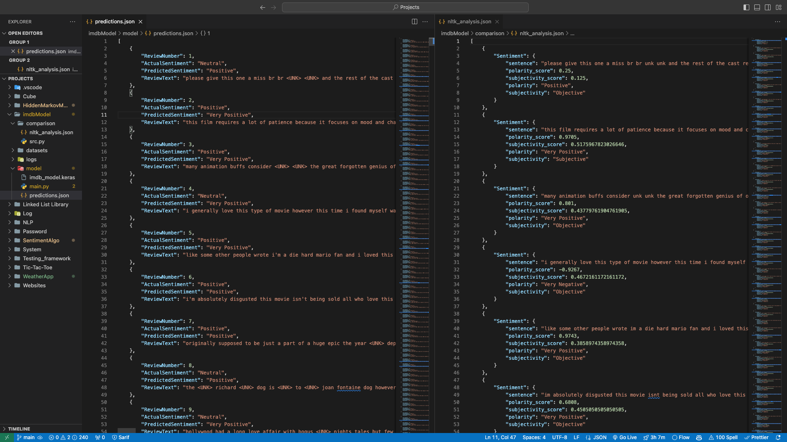

# IMDb Sentiment Analysis ML Model

## Overview

This repository contains the source code and documentation for an IMDb sentiment analysis machine learning model. The model is designed to analyze the sentiment (positive or negative) of movie reviews from the IMDb dataset.

## Table of Contents

- [Getting Started](#getting-started)
  - [Fundamentals](#fundamentals)
  - [Prerequisites](#prerequisites)
  - [Installation](#installation)
    - [Data-Sets](#data-sets)
- [Usage](#usage)
- [Results](#results)
- [Documentation](#documentation)
- [Structure](#structure)
- [Contributing](#contributing)
- [License](#license)
- [Acknowledgments](#acknowledgments)

## Getting Started

### Fundamentals

This script showcases the construction, training, and evaluation of a sentiment analysis model using the IMDb dataset. The model is a basic neural network composed of an embedding layer, flattening layer, dense layer, and a sigmoid output layer.

**Type of Algorithm:**
- Neural Network (Basic)

**Key Components:**
- Embedding Layer
- Flattening Layer
- Dense Layer
- Sigmoid Output Layer

**Dependencies (Rough):**
- TensorFlow
- NumPy
- fetch.py
- tqdm

### Prerequisites

Before you begin, ensure you have the following dependencies installed. To do this, run the following command in your terminal 

```bash
pip3 install requirements
```

```bash
# Running cat requirements.txt

absl-py==2.0.0
anyio==3.6.2
appnope==0.1.3
argon2-cffi==21.3.0
argon2-cffi-bindings==21.2.0
arrow==1.2.3
asttokens==2.2.1
astunparse==1.6.3
attrs==22.2.0
backcall==0.2.0
beautifulsoup4==4.12.0
bleach==6.0.0
.
.
.
```

#### Data-Sets

Due to SSL challenges during dataset download, a manual download is suggested. The dataset is automatically searched for in the current working directory and its subdirectories.

Links:
- [IMDb Data Set Link](https://ai.stanford.edu/~amaas/data/sentiment/)
- [IMDb Word Index Link](https://s3.amazonaws.com/text-datasets/IMDb_word_index.json)

1. Clone the repository:

   ```bash
   git clone https://github.com/j-balkovec/CodeHub/IMDb_model.git
   ```

2. Navigate to the project directory:

   ```bash
   cd IMDb_model
   ```
### Usage
To run the model simply run the following command in the terminal

```bash
# Assuming already in the model directory
python3 model.py
```

The procedure that will be executed:
- Loads the IMDb dataset
- Prepossesses the data
- Builds and trains the model
- Makes predictions

### Results

The model's outcomes were juxtaposed with those of a sentiment analysis script leveraging the NLTK library to determine string polarity. Notably, both the script and the model yielded highly comparable results. If you'd like to experiment with this independently, execute the following command in the terminal:

```bash
# Assuming already in the nltk_analysis directory
python3 src.py
```



### Documentation

In progress

### Structure

```bash

tree
.
├── LICENSE
├── Makefile
├── README.md
├── __init__.py
├── build
│   ├── doctrees
│   │   ├── environment.pickle
│   │   └── index.doctree
│   ├── environment.pickle
│   ├── html
│   │   ├── _sources
│   │   │   └── index.rst.txt
│   │   ├── _static
│   │   │   ├── _sphinx_javascript_frameworks_compat.js
│   │   │   ├── basic.css
│   │   │   ├── css
│   │   │   │   ├── badge_only.css
│   │   │   │   ├── fonts
│   │   │   │   │   ├── Roboto-Slab-Bold.woff
│   │   │   │   │   ├── Roboto-Slab-Bold.woff2
│   │   │   │   │   ├── Roboto-Slab-Regular.woff
│   │   │   │   │   ├── Roboto-Slab-Regular.woff2
│   │   │   │   │   ├── fontawesome-webfont.eot
│   │   │   │   │   ├── fontawesome-webfont.svg
│   │   │   │   │   ├── fontawesome-webfont.ttf
│   │   │   │   │   ├── fontawesome-webfont.woff
│   │   │   │   │   ├── fontawesome-webfont.woff2
│   │   │   │   │   ├── lato-bold-italic.woff
│   │   │   │   │   ├── lato-bold-italic.woff2
│   │   │   │   │   ├── lato-bold.woff
│   │   │   │   │   ├── lato-bold.woff2
│   │   │   │   │   ├── lato-normal-italic.woff
│   │   │   │   │   ├── lato-normal-italic.woff2
│   │   │   │   │   ├── lato-normal.woff
│   │   │   │   │   └── lato-normal.woff2
│   │   │   │   └── theme.css
│   │   │   ├── doctools.js
│   │   │   ├── documentation_options.js
│   │   │   ├── file.png
│   │   │   ├── jquery.js
│   │   │   ├── js
│   │   │   │   ├── badge_only.js
│   │   │   │   ├── html5shiv-printshiv.min.js
│   │   │   │   ├── html5shiv.min.js
│   │   │   │   └── theme.js
│   │   │   ├── language_data.js
│   │   │   ├── minus.png
│   │   │   ├── plus.png
│   │   │   ├── pygments.css
│   │   │   ├── searchtools.js
│   │   │   └── sphinx_highlight.js
│   │   ├── genindex.html
│   │   ├── index.html
│   │   ├── objects.inv
│   │   ├── search.html
│   │   └── searchindex.js
│   └── index.doctree
├── datasets
│   ├── imdb.npz
│   └── imdb_word_index.json
├── documentation
│   ├── _sources
│   │   └── index.rst.txt
│   ├── _sources 2
│   ├── _static
│   │   ├── _sphinx_javascript_frameworks_compat.js
│   │   ├── basic.css
│   │   ├── css
│   │   │   ├── badge_only.css
│   │   │   ├── fonts
│   │   │   │   ├── Roboto-Slab-Bold.woff
│   │   │   │   ├── Roboto-Slab-Bold.woff2
│   │   │   │   ├── Roboto-Slab-Regular.woff
│   │   │   │   ├── Roboto-Slab-Regular.woff2
│   │   │   │   ├── fontawesome-webfont.eot
│   │   │   │   ├── fontawesome-webfont.svg
│   │   │   │   ├── fontawesome-webfont.ttf
│   │   │   │   ├── fontawesome-webfont.woff
│   │   │   │   ├── fontawesome-webfont.woff2
│   │   │   │   ├── lato-bold-italic.woff
│   │   │   │   ├── lato-bold-italic.woff2
│   │   │   │   ├── lato-bold.woff
│   │   │   │   ├── lato-bold.woff2
│   │   │   │   ├── lato-normal-italic.woff
│   │   │   │   ├── lato-normal-italic.woff2
│   │   │   │   ├── lato-normal.woff
│   │   │   │   └── lato-normal.woff2
│   │   │   └── theme.css
│   │   ├── doctools.js
│   │   ├── documentation_options.js
│   │   ├── file.png
│   │   ├── jquery.js
│   │   ├── js
│   │   │   ├── badge_only.js
│   │   │   ├── html5shiv-printshiv.min.js
│   │   │   ├── html5shiv.min.js
│   │   │   └── theme.js
│   │   ├── language_data.js
│   │   ├── minus.png
│   │   ├── plus.png
│   │   ├── pygments.css
│   │   ├── searchtools.js
│   │   └── sphinx_highlight.js
│   ├── _static 2
│   ├── genindex.html
│   ├── index.html
│   ├── objects.inv
│   ├── search.html
│   └── searchindex.js
├── make.bat
├── model
│   ├── __init__.py
│   ├── __pycache__
│   │   └── main.cpython-311.pyc
│   ├── imdb_model.keras
│   ├── main.py
│   ├── main.rst
│   └── predictions.json
├── nltk_analysis
│   ├── __init__.py
│   ├── __pycache__
│   │   └── src.cpython-311.pyc
│   ├── comparison.png
│   ├── nltk_analysis.json
│   ├── src.py
│   └── src.rst
├── requirements.txt
├── source
│   ├── _static
│   ├── _templates
│   ├── conf.py
│   └── index.rst
└── utility
    ├── __init__.py
    ├── __pycache__
    │   ├── __init__.cpython-311.pyc
    │   └── fetch.cpython-311.pyc
    ├── fetch.py
    └── fetch.rst
```

## Contributing

Contributions are always welcome! If you find a bug, have a suggestion, or want to add a new feature, feel free to issue a pull request. We appreciate your help in making this project better for everyone.

### License
This project is licensed under the [MIT](LICENSE) - see the LICENSE file for details.
